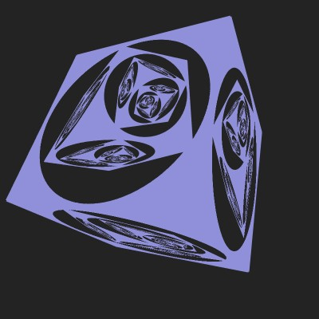

# p5.js Demos

A collection of graphics demos for Processing+[p5.js](https://p5js.org/). Demos are available at OpenProcessing: https://openprocessing.org/user/275829

## Dithering

Post-processing with a dithering shader of a Möbius strip. The demo creates a custom **[p5.Geometry](https://p5js.org/reference/#/p5.Geometry)** object as described by an article by Paul Wheeler: [Custom 3D Geometry in P5.js](https://www.paulwheeler.us/articles/custom-3d-geometry-in-p5js/).

## Dithering-2

Post-processing with a dithering shader of a scene with a hexapod 3D object.

Script for generating the hexapod 3D mesh is can be found at [generate_hexapod](generate_hexapod/). The script uses [sdf module](https://github.com/fogleman/sdf) for Python by [Michael Fogleman](https://github.com/fogleman/) for creating a procedural mesh.

## Infinity Cube

Demo that uses off-screen rendering and texturing to 'infinite inner cubes' illusion.

## Infinity Cube-2

Different cube design and rendering using **[TESS](https://p5js.org/reference/#/p5/beginShape)** shape.

Bare JS+WebGL version: https://postrediori.gitlab.io/EndlessCube/

## Julia Set

WebGL 2D shader with a Julia set.

## Logistic Map

Visualising bifurcation plot for the logistic map. 

## Marching Triangles

Simple contour detection with marching triangles algorithm.

## Marching Triangles-2

Multiple levels of contour detection with marching triangles algorithm.

## Random Circles

Filling 2D space with random circles. Size decay function described in [Random space filling of the plane](http://paulbourke.net/fractals/randomtile/) by Paul Bourke.

## Random Polygons

Filling 2D space with random 3-, 4-, 5- and -6sided polygons. Polygon intersection code from [Random space filling of the plane](http://paulbourke.net/fractals/randomtile/) by Paul Bourke.

## Random Flowers

Filling 2D space flower shapes called [Rose curve](https://en.wikipedia.org/wiki/Rose_(mathematics)) or rhodonea curve.

## Raspberry Heaven

Re-creation of [Raspberry Heaven music video](https://www.youtube.com/watch?v=NBzKXP9cnIQ). A simple simulation of particles falling in wind.

## Scattered Letters

Filing 2D space with non-overlapping letters. A port to p5.js of [Scattered Letters](https://openprocessing.org/sketch/1811) by Algirdas Rascius.

Original blog post (archived): [Scattered Letters](https://web.archive.org/web/20090913054525/http://mydigiverse.com/2009/05/scattered-letters/)

## Scattered Hiragana

Tiling 2D space with hiragana symbols.

## Virtual Earth

Simple 2D shader with a rotating 3D globe made with rendering of an illusion of depth.

Earth surface and clouds texture by NASA:
* [Collection: Blue Marble](https://visibleearth.nasa.gov/collection/1484/blue-marble)
  * [Blue Marble: Land Surface, Shallow Water, and Shaded Topography](https://visibleearth.nasa.gov/images/57752/blue-marble-land-surface-shallow-water-and-shaded-topography)
  * [Blue Marble: Clouds](https://visibleearth.nasa.gov/images/57747/blue-marble-clouds)

## Wang Dominoes

Tiling 2D space with a random pattern using [Wang dominoes](https://en.wikipedia.org/wiki/Wang_tile).

## Wang Circuits

Tiling 2D space with a random electronic circuit using Wang dominoes.

